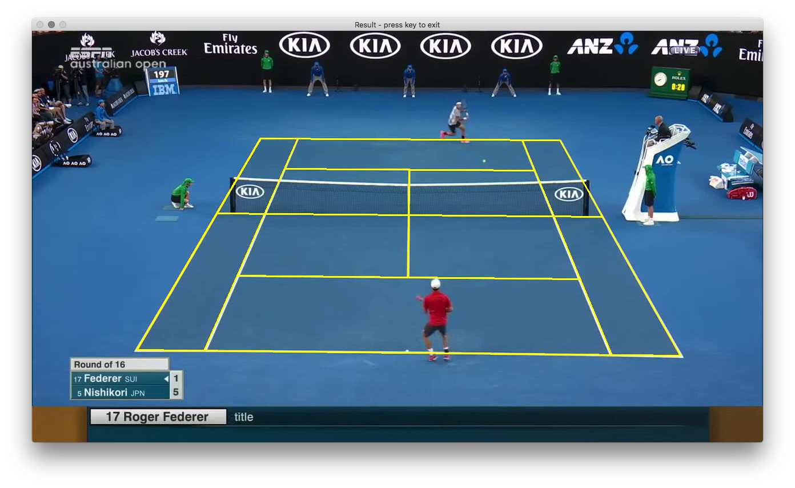

# tennis-court-detection

[](https://opensource.org/licenses/BSD-3-Clause)

Fully automatic algorithm for tennis court line detection. Implementation based on Farin
D. et al. "Robust Camera Calibration for Sports Videos using Court Models", *Storage and
Retrieval Methods and Applications for Multimedia 2004*, 2003.



# Installation instructions

```
git clone https://github.com/gchlebus/tennis-court-detection.git
cd tennis-court-detection
make
```

# Usage

The detection algorithm is started for the middle frame of the input video file (in avi
format).

```
Usage: ./detect video_path [output_path]
       video_path:  path to an input avi file.
       output_path: path to an output file where the xy court point coordinates will be written.
                    This argument is optional. If not present, then a window with the result will be opened.
```

## Output file

The output file contains one point per line. The XY coordinates are separated by a
semicolon ";".  The points are in the following order:

```
1.  Intersection of the upper base line with the left side line
2.  Intersection of the lower base line with the left side line
3.  Intersection of the lower base line with the right side line
4.  Intersection of the upper base line with the right side line
5.  Intersection of the upper base line with the left singles line
6.  Intersection of the lower base line with the left singles line
7.  Intersection of the lower base line with the right singles line
8.  Intersection of the upper base line with the right singles line
9.  Intersection of the left singles line with the upper service line
10. Intersection of the right singles line with the upper service line
11. Intersection of the left singles line with the lower service line
12. Intersection of the right singles line with the lower service line
13. Intersection of the upper service line with the center service line
14. Intersection of the lower service line with the center service line
15. Intersection of the left side line with the net line
16. Intersection of the right side line with the net line
```

